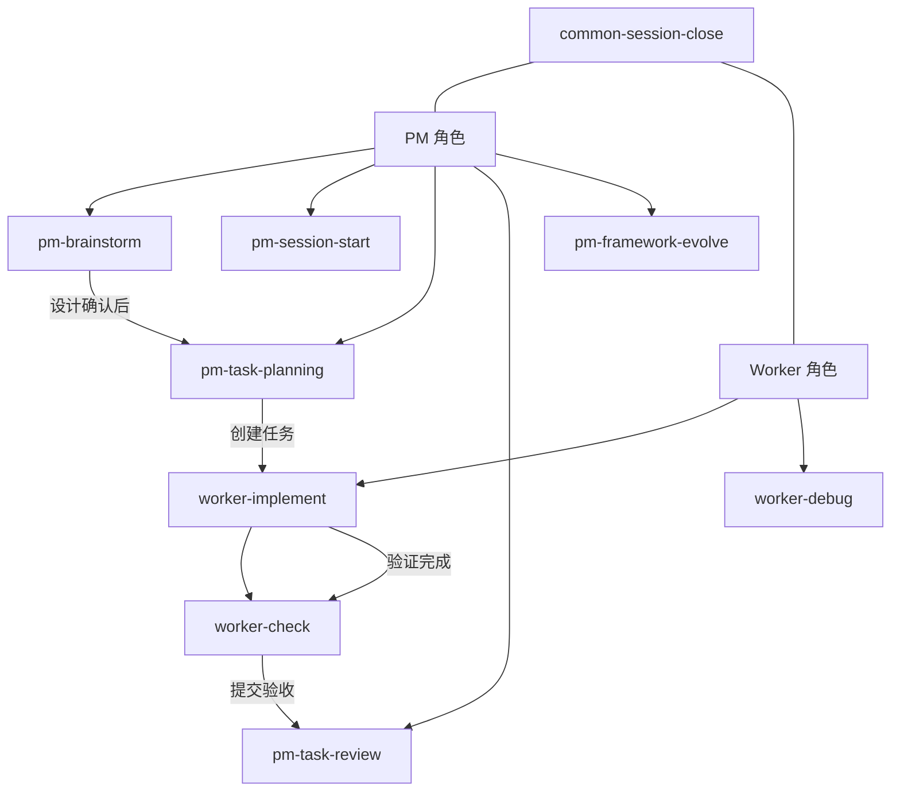

# easyAI 功能详细说明

> 本文档是框架知识库的一部分，供 AI 在框架自迭代时参考。

## Skills（能力模块）

### PM 专属

| Skill | 触发条件 | 职责 |
|-------|----------|------|
| `pm-brainstorm` | PM 接收到用户新需求时 | 苏格拉底式需求发散，将用户想法转化为完整设计 |
| `pm-session-start` | `/pm` 触发后 | 自动读取项目状态、恢复任务上下文、加载最新日志 |
| `pm-task-planning` | PM 完成需求澄清后 | 将设计文档转化为约束集格式的任务定义 |
| `pm-task-review` | PM 审查执行者提交的任务时 | 三阶段验收（Spec 合规 → 代码质量 → Artifacts 沉淀） |
| `pm-framework-evolve` | 需要修改框架文件或查询框架知识时 | 框架百科 + 安全迭代 + 迭代记录 + 知识库自更新 |

### Worker 专属

| Skill | 触发条件 | 职责 |
|-------|----------|------|
| `worker-implement` | Worker 开始实现任务时 | TDD 铁律驱动的编码流程 |
| `worker-check` | `worker-implement` 完成后 | 强制验证流程，生成 verification.md |
| `worker-debug` | 遇到 Bug、测试失败时 | 4 阶段根因分析 + 3 次失败上报 PM |

### 通用

| Skill | 触发条件 | 职责 |
|-------|----------|------|
| `common-session-close` | 会话结束前 | 汇总工作、写入 journal、Artifacts 沉淀检查 |
| `common-spec-update` | 需要更新 `.trellis/spec/` 时 | 安全地更新项目规范文件 |

---

## Rules（规则）

| Rule | 作用 | 约束层级 |
|------|------|----------|
| `project-identity.md` | 项目身份声明 — 框架地图、角色系统、约束分层、冲突解决 | L1（硬约束） |
| `anti-hallucination.md` | 反幻觉约束 — 第三方库必须先查文档、禁止模糊措辞、RPI 阶段隔离 | L1（硬约束） |
| `coding-standards.md` | 编码规范 — 命名、格式、注释标准 | L1（硬约束） |
| `framework-dev-mode.md` | 框架开发模式 — 仅存在于开发工作区，不同步到 skeleton | L1（硬约束） |

---

## MCP Tools

| Tool | 功能 |
|------|------|
| `task_create` | 创建新任务 |
| `task_get` | 获取任务详情 |
| `task_list` | 列出所有任务 |
| `task_transition` | 任务状态流转 |
| `task_cancel` | 取消任务 |
| `task_append_log` | 追加任务执行记录 |
| `subtask_create` / `subtask_list` | 子任务管理 |
| `journal_append` | 写入 journal 日志 |
| `journal_search` | 搜索 journal 记录 |
| `plan_validate` | 反面模式自检 |
| `spec_validate` | 规范文件校验 |
| `conflict_check` | Glob 冲突检测 |
| `context_budget` | 上下文预算查询 |
| `context_generate` | 上下文生成 |
| `framework_init` / `framework_check` / `framework_update` | 框架管理（在 `framework-tools.ts` 中） |

## MCP Resources

| Resource URI | 功能 |
|-------------|------|
| `trellis://journal/latest` | 最新 journal 日志 |
| `trellis://status/overview` | 项目状态概览 |
| `spec://{category}/{name}` | 项目规范文件 |
| `trellis://tasks/{task_id}/context` | 任务上下文 |
| `trellis://subtasks/{task_id}/context` | 子任务上下文 |

---

## 关联关系

