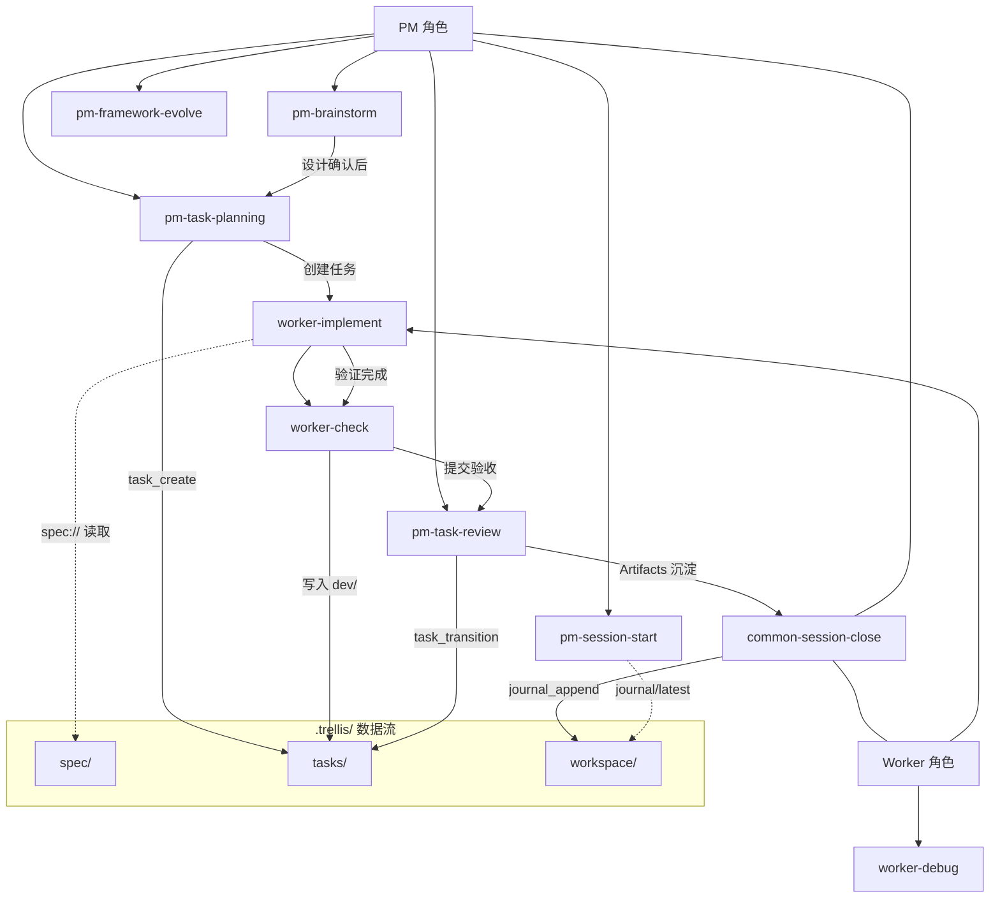

# easyAI 功能详细说明

> 本文档是框架知识库的一部分，供 AI 在框架自迭代时参考。

<!-- 本文件由 /publish 流程同步维护，请勿手动修改数量统计 -->
<!-- last_synced: 2026-03-15 -->

## 目录

- [Skills（10 个）](#skills10-个能力模块)
- [Workflows（3 个）](#workflows3-个)
- [Rules（3+1 个）](#rules3-个骨架--1-个开发专属)
- [MCP Tools（23 个）](#mcp-tools23-个)
- [MCP Resources（6 个）](#mcp-resources6-个)
- [关联关系](#关联关系)

## Skills（10 个能力模块）

### PM 专属（5 个）

| Skill                 | 触发条件                         | 职责                                           | 消费的 .trellis 数据                                                          |
| --------------------- | -------------------------------- | ---------------------------------------------- | ----------------------------------------------------------------------------- |
| `pm-session-start`    | `/pm` 触发后                     | 自动读取项目状态、恢复任务上下文、加载最新日志 | `workspace/journal`（读）、`tasks/`（读）、`spec/`（状态扫描）                |
| `pm-brainstorm`       | PM 接收到用户新需求时            | 苏格拉底式需求发散，将用户想法转化为完整设计   | `tasks/`（写：task_create）、`spec/`（读+演进判断）                           |
| `pm-task-planning`    | PM 完成需求澄清后                | 将设计文档转化为约束集格式的任务定义           | `tasks/`（写：task_create + context_generate + context.jsonl）、`spec/`（读） |
| `pm-task-review`      | PM 审查执行者提交的任务时        | 三阶段验收 + Worktree 闭环（merge/cleanup）    | `tasks/`（读+写：task_transition）、`spec/`（读：合规审查）                   |
| `pm-framework-evolve` | 需要修改框架文件或查询框架知识时 | 框架百科 + 安全迭代 + 知识库自更新             | `spec/`（修改框架规范时）                                                     |

### Worker 专属（3 个）

| Skill              | 触发条件                  | 职责                                                     | 消费的 .trellis 数据                                |
| ------------------ | ------------------------- | -------------------------------------------------------- | --------------------------------------------------- |
| `worker-implement` | Worker 开始实现任务时     | TDD 铁律驱动的编码流程                                   | `tasks/`（读：任务上下文）、`spec/`（读：项目规范） |
| `worker-check`     | `worker-implement` 完成后 | 强制验证流程，生成 verification.md，Git 自动提交任务产物 | `tasks/`（写：验证产物存入 dev/）                   |
| `worker-debug`     | 遇到 Bug、测试失败时      | 4 阶段根因分析 + 3 次失败上报 PM                         | —                                                   |

### 通用（2 个）

| Skill                  | 触发条件                                      | 职责                                           | 消费的 .trellis 数据                      |
| ---------------------- | --------------------------------------------- | ---------------------------------------------- | ----------------------------------------- |
| `common-session-close` | 用户说「收工」/ 会话结束 / 上下文预算接近阈值 | 汇总工作、写入 journal、Git 自动提交、恢复指引 | `workspace/journal`（写：journal_append） |
| `common-spec-update`   | 需要更新 `.trellis/spec/` 时                  | 安全地更新项目规范文件                         | `spec/`（读+写）                          |

---

## Workflows（3 个）

| Workflow     | 触发命令       | 职责                                               | 消费的 .trellis 数据      |
| ------------ | -------------- | -------------------------------------------------- | ------------------------- |
| `pm.md`      | `/pm`          | PM 角色入口 — 需求沟通、任务管理、验收审批         | 通过 Skills 间接消费      |
| `worker.md`  | `/worker T001` | Worker 角色入口 — 读取任务、按约束集执行、产出报告 | 通过 Skills 间接消费      |
| `publish.md` | `/publish`     | 框架发布 — 构建、同步 skeleton、推送 GitHub + npm  | `spec/`（同步到发行目录） |

---

## Rules（3 个骨架 + 1 个开发专属）

| Rule                    | 作用                                                          | 分类        |
| ----------------------- | ------------------------------------------------------------- | ----------- |
| `project-identity.md`   | 项目身份声明 — 框架地图、角色系统、约束分层、冲突解决         | 🦴 骨架     |
| `anti-hallucination.md` | 反幻觉约束 — 第三方库必须先查文档、禁止模糊措辞、RPI 阶段隔离 | 🦴 骨架     |
| `coding-standards.md`   | 编码规范 — 命名、格式、注释标准                               | 🦴 骨架     |
| `framework-dev-mode.md` | 框架开发模式 — 三层版本流转、PM 使用本 Skill 的方式           | 🔧 开发专属 |

---

## MCP Tools（23 个）

### 任务管理（6 个）

| Tool              | 功能                                  |
| ----------------- | ------------------------------------- |
| `task_create`     | 创建新任务                            |
| `task_get`        | 获取任务详情（含冻结上下文快照）      |
| `task_list`       | 列出所有任务（支持状态过滤）          |
| `task_transition` | 任务状态流转（含 Evidence Gate 校验） |
| `task_cancel`     | 取消任务                              |
| `task_append_log` | 追加任务执行记录                      |

### 子任务（2 个）

| Tool                       | 功能                                       |
| -------------------------- | ------------------------------------------ |
| `subtask_create`           | 创建子任务（支持 DAG 依赖声明 + 循环检测） |
| `subtask_dependency_graph` | 获取子任务依赖图                           |

### 日志（2 个）

| Tool             | 功能                                      |
| ---------------- | ----------------------------------------- |
| `journal_append` | 写入 journal 日志                         |
| `journal_search` | 搜索 journal 记录（按标签、关键词、日期） |

### 上下文管理（2 个）

| Tool               | 功能                                                      |
| ------------------ | --------------------------------------------------------- |
| `context_budget`   | 估算当前 Token 消耗（超 60% 建议降级，超 80% 建议新会话） |
| `context_generate` | 生成 context.jsonl 推荐清单                               |

### 质量保障（3 个）

| Tool             | 功能                                        |
| ---------------- | ------------------------------------------- |
| `plan_validate`  | 反面模式自检（多方案未选择、推迟决策等）    |
| `spec_validate`  | 规范文件格式校验（必须字段、SemVer 版本号） |
| `conflict_check` | 文件范围冲突检测（Glob 模式匹配）           |

### 框架管理（3 个）

| Tool               | 功能                      |
| ------------------ | ------------------------- |
| `framework_init`   | 初始化框架到项目          |
| `framework_check`  | 检查框架完整性            |
| `framework_update` | Manifest 驱动智能合并升级 |

### Git Worktree（4 个）

| Tool               | 功能                                         |
| ------------------ | -------------------------------------------- |
| `worktree_create`  | 为任务创建 Git worktree（并行任务物理隔离）  |
| `worktree_merge`   | 将 worktree 分支合并回目标分支（含安全预检） |
| `worktree_cleanup` | 清理 worktree 及其分支（含未提交检查）       |
| `worktree_list`    | 查询所有任务关联的 worktree 状态             |

### 项目状态（1 个）

| Tool             | 功能                                      |
| ---------------- | ----------------------------------------- |
| `project_status` | 获取项目当前状态概览（Git + 任务 + 日志） |

---

## MCP Resources（6 个）

| Resource URI                           | 功能                              |
| -------------------------------------- | --------------------------------- |
| `trellis://status`                     | 项目状态概览（Git + 任务 + 日志） |
| `trellis://journal/latest`             | 最新 journal 日志                 |
| `spec://{category}/{name}`             | 项目规范文件                      |
| `trellis://tasks/{task_id}/context`    | 任务上下文（含冻结快照）          |
| `trellis://subtasks/{task_id}/context` | 子任务依赖上下文                  |
| `trellis://tasks/{task_id}/frozen`     | 冻结的 spec 快照（Phase-Frozen）  |

---

## 关联关系

